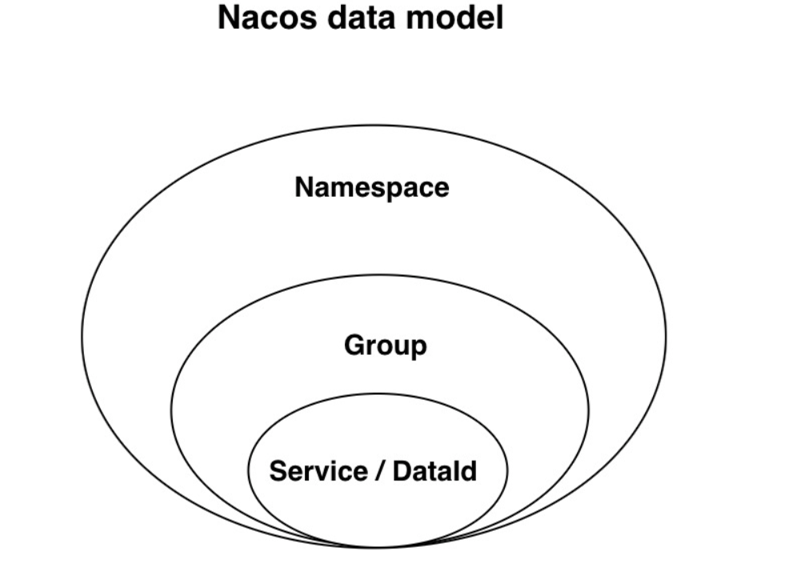

#### Namespace（命名空间）
- **概念**：命名空间用于实现隔离。比如，你可以为开发环境、测试环境和生产环境创建三个不同的命名空间，这样它们之间的配置就不会相互干扰。
- **类比**：命名空间就像图书馆中的不同阅览室，每个阅览室都有其特定的使用目的和规则，比如儿童阅览室、成人阅览室等。
#### Group（分组）
- **概念**：分组是进一步在命名空间内部对服务进行分类的方式。可以根据服务的性质或者其他标准将服务分成不同的组。
- **类比**：在每个阅览室内，书籍可能会根据题材、作者或读者年龄分成不同的组，比如文学作品组、科技书籍组等。
#### Data ID（数据标识）
- **概念**：Data ID 是配置信息的唯一标识符。在 Nacos 配置管理中，每项配置信息都会有一个唯一的 Data ID，用于唯一标识这项配置。
- **类比**：每本书都有一个唯一的ISBN号，通过这个号码可以准确找到图书馆里的这本书。
#### Service（服务）
- **概念**：服务是指系统中提供的一个功能或者一组功能的集合，每个服务都有一个唯一的标识符。
- **类比**：图书馆的每项服务，比如借书服务、咨询服务，都是为了满足访客的不同需求。
#### Snapshot（配置快照）
- **概念**：捕捉并保存系统或数据在某一个瞬间的精确副本。提供了一种方便的方式回溯到过去的状态，无需重新创建或手动恢复整个系统或数据集。
- **类比**：假设图书馆系统因为一次更新而遇到了问题，系统变得不稳定。幸运的是，在更新前，创建了一个系统的快照，可以回溯到这个快照的系统状态。
#### 他们之间的关系和联系
命名空间、分组、Data ID 和服务共同工作，以提供高效、有序的配置和服务管理。命名空间提供了最顶层的隔离，每个命名空间下可以有多个分组，每个分组里可以有多个不同的服务，而每个服务可能需要多个不同的配置（每个配置由 Data ID 唯一标识）。
#### 例子
假设一个图书馆系统部署在云上，我们可以这样组织它的配置：
- **命名空间**：我们创建三个命名空间，分别为“开发”、“测试”和“生产”。
- **分组**：在每个命名空间内，我们根据服务的类型创建分组，比如“前端服务”组和“后端服务”组。
- **Data ID**：在“前端服务”组内，我们可能有多个配置文件，比如`frontend-config.json`和`frontend-theme.json`，每个文件都有一个唯一的 Data ID。
- **服务**：在“后端服务”组内，我们可能部署了用户管理服务、书籍管理服务等不同的服务，每个服务都有自己的配置需求。